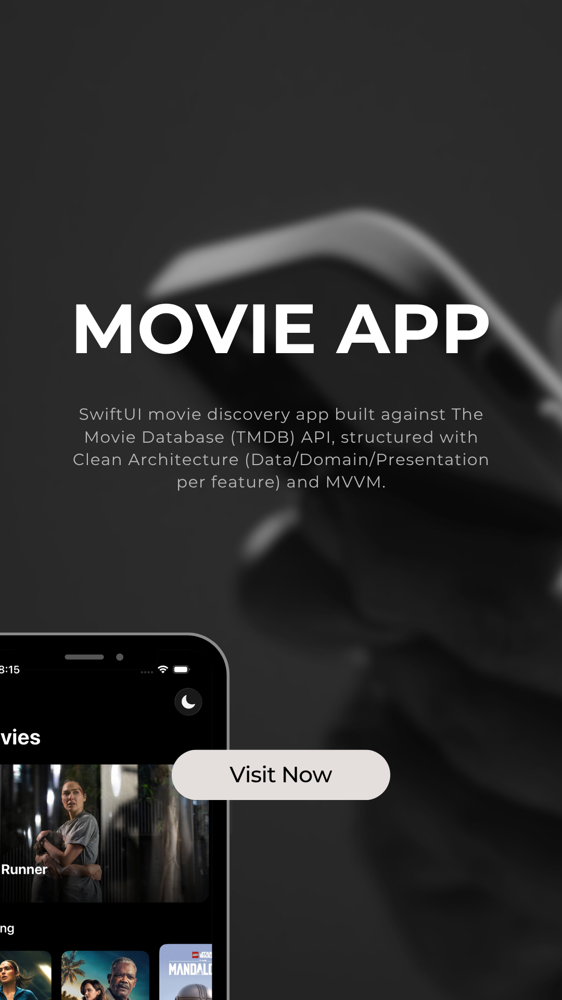
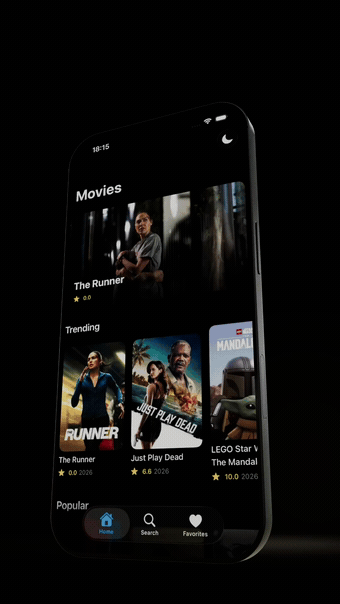

# MovieBox

A movie discovery app for iOS, built with SwiftUI and The Movie Database (TMDB) API. Users can browse trending, popular, now-playing, top-rated, and upcoming movies, search the full TMDB catalog, view detailed information for any title, and save favorites that persist locally on the device.

This project was built as a demonstration of a production-style iOS architecture: Clean Architecture layered per feature, MVVM presentation, Swift Concurrency throughout, and no hardcoded configuration.

## Preview

<table>
  <tr>
    <th>Screenshot</th>
    <th>Demo</th>
  </tr>
  <tr>
    <td></td>
    <td></td>
  </tr>
</table>


## Features

- **Home** — a cinematic feed with a featured movie hero card plus horizontal carousels for Trending, Popular, Now Playing, Top Rated, and Upcoming, with pull-to-refresh and skeleton loading states.
- **Search** — debounced, paginated search against the TMDB catalog, with recent search history and empty/error states.
- **Movie Details** — backdrop, poster, rating, runtime, genres, overview, cast, similar movies, and a trailer link, all loaded concurrently.
- **Favorites** — add or remove any movie from its details screen; favorites persist across launches via SwiftData and are browsable in their own tab.
- **Appearance** — a System / Light / Dark picker that overrides the device appearance and remembers the choice.
- **Image caching** — a two-tier cache (in-memory + on-disk) so posters and backdrops load instantly on repeat views and survive app relaunches.

## Architecture

The codebase follows **Clean Architecture** with a **feature-first** folder layout: each feature owns its own Data, Domain, and Presentation layers, while code shared by two or more features lives in `Core`.

```
Presentation (Views, ViewModels)
        |
        v
   Domain (Use Cases)
        |
        v
Domain (Entities, Repository protocols)   <-- shared contracts, in Core
        |
        v
   Data (Repository implementations, Data Sources, DTOs, Mappers)  <-- in Core
        |
        v
   TMDB API / SwiftData
```

**Why some layers live in `Core` instead of a feature:** the `Movie` entity is used by every feature, and the shared `MovieRepository`/`FavoritesRepository` protocols return entities like `MovieDetails`, `CastMember`, and `Video` directly in their method signatures. Moving those into a single feature's folder would force `Core` to depend on `Features`, inverting the dependency direction the architecture is built on. Use cases, by contrast, are thin single-operation wrappers, so each one lives inside the one feature that actually calls it — with the single exception of `RemoveFavoriteUseCase`, which both the Movie Details screen (unfavoriting) and the Favorites screen (swipe-to-delete) call, so it stays shared.

### Project structure

```
MovieBox/
├── App/                        Composition root: entry point, dependency
│   │                            injection container, tab navigation root
│   └── Navigation/              AppRouter, deep link parsing, route types
│
├── Core/                       Shared across two or more features
│   ├── Configuration/          Environment values, app-wide constants
│   ├── Networking/             APIClient, endpoint/request building, errors
│   ├── ImageLoading/           Cached image loading pipeline
│   ├── Theme/                  Appearance selection and persistence
│   ├── Components/             Reusable SwiftUI views (cards, states, skeletons)
│   ├── Domain/
│   │   ├── Entities/           Movie, Genre, CastMember, Video, MovieDetails
│   │   ├── Repositories/       MovieRepository, FavoritesRepository (protocols)
│   │   └── UseCases/           Operations shared by more than one feature
│   └── Data/
│       ├── DTOs/                TMDB response models
│       ├── DataSources/         Remote (TMDB) and Local (SwiftData)
│       ├── Mappers/             DTO <-> Domain entity conversion
│       └── Repositories/        Repository protocol implementations
│
└── Features/
    ├── Home/
    │   ├── Domain/UseCases/     Get{Trending,Popular,NowPlaying,TopRated,Upcoming}MoviesUseCase
    │   └── Presentation/        Views, ViewModels, Components
    ├── Search/
    │   ├── Data/                 Recent search history (local persistence)
    │   ├── Domain/UseCases/      SearchMoviesUseCase
    │   └── Presentation/
    ├── MovieDetails/
    │   ├── Domain/UseCases/      GetMovieDetails/Credits/Similar/Videos, favorite toggling
    │   └── Presentation/
    └── Favorites/
        ├── Domain/UseCases/      GetFavoritesUseCase
        └── Presentation/
```

### Coding principles

- Views never make network or persistence calls directly; they call into a ViewModel, which calls a Use Case.
- The Domain layer imports neither SwiftUI, URLSession, nor SwiftData — it has no knowledge of how data is fetched or displayed.
- TMDB response models (DTOs) never reach a View; they are mapped to Domain entities before leaving the Data layer.
- All configuration (API key, base URLs, timeouts, page sizes, image sizes) is centralized in `AppConfiguration` — nothing is hardcoded in a feature.
- Dependencies are constructed once, in `AppContainer`, and injected into ViewModels — never created inside a View.

## Tech stack

- Swift, SwiftUI
- Swift Concurrency (`async`/`await`)
- Observation framework (`@Observable`)
- SwiftData (local persistence for favorites)
- URLSession (networking, no third-party HTTP library)
- TMDB API v3

## Requirements

- Xcode 26 or later
- iOS 26.4 simulator or device (the project's deployment target)
- A free TMDB account and API key

## Getting started

### 1. Clone the repository

```bash
git clone https://github.com/AbdulKhaliq59/movie-app-swift.git
cd movie-app-swift
```

### 2. Get a TMDB API key

Create a free account at [themoviedb.org](https://www.themoviedb.org/) and request an API key at [themoviedb.org/settings/api](https://www.themoviedb.org/settings/api). The v3 API key (a plain alphanumeric string, not the v4 Bearer token) is what this project uses.

### 3. Configure your API key

The project reads configuration from a local, gitignored `Secrets.swift` file instead of committing a key to source control. From the repository root:

```bash
cp MovieBox/Core/Configuration/Secrets.swift.example MovieBox/Core/Configuration/Secrets.swift
```

Then open `MovieBox/Core/Configuration/Secrets.swift` and replace the placeholder with your key:

```swift
enum Secrets {
    static let tmdbAPIKey = "YOUR_TMDB_API_KEY"
    static let tmdbBaseURL = "https://api.themoviedb.org/3"
    static let tmdbImageBaseURL = "https://image.tmdb.org/t/p"
}
```

`Secrets.swift` is listed in `.gitignore` and will never be committed. All other configuration (request timeout, page size, image sizes) is defined in `AppConfiguration.swift` and does not need to be changed to run the app.

### 4. Open and run

```bash
open MovieBox.xcodeproj
```

In Xcode, select the `MovieBox` scheme, choose a simulator (or a connected device), and run (Cmd+R). No CocoaPods, Swift Package dependencies, or additional build steps are required — the project only depends on Apple's own frameworks.

If the API key has not been configured yet, the app still launches; screens that require network data will show their error state until `Secrets.swift` is filled in.

## Notes on the demo assets

The screenshot and GIF under `MovieBox/Assets.xcassets/app_presentation/` are included for demonstration purposes only, so a reader of this repository can see the app in action without building it. They are not referenced by any app code and are not part of the compiled app bundle's usable asset catalog entries. The GIF was generated from a screen recording with `ffmpeg` (palette-based encoding) so it renders inline in this README, since GitHub only auto-plays `<video>` elements for files uploaded through its own web UI, not for video files tracked directly in the repository.

## Deep linking

The app registers the `moviebox://` URL scheme and routes incoming links through a dedicated `AppRouter` (`App/Navigation/`), which owns the selected tab and each tab's navigation path as shared, externally-controllable state rather than state private to each screen.

Supported links:

| Link | Behavior |
| --- | --- |
| `moviebox://home` | Switches to the Home tab and pops its stack to the root. |
| `moviebox://search?q=<term>` | Switches to Search and runs a search for `<term>`. |
| `moviebox://favorites` | Switches to the Favorites tab and pops its stack to the root. |
| `moviebox://movie/<id>` | Pushes Movie Details for the given TMDB movie id, on top of whichever tab is currently active. |

A movie deep link carries only an id, not a full `Movie` (the caller may not have one), so it is resolved through a small loader view that fetches the movie's details before handing off to the same `MovieDetailsView` used for in-app navigation — in-app taps still route on the already-known `Movie` directly, avoiding a redundant network call.

To try it with the app running in Simulator:

```bash
xcrun simctl openurl booted "moviebox://movie/1386315"
xcrun simctl openurl booted "moviebox://search?q=batman"
```

## Attribution

This product uses the TMDB API but is not endorsed or certified by TMDB.


## License

No license has been specified for this project. All rights reserved by the author unless stated otherwise.
